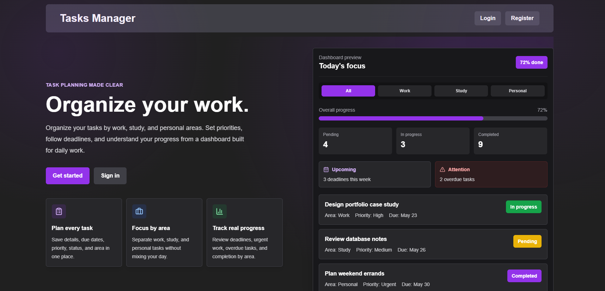
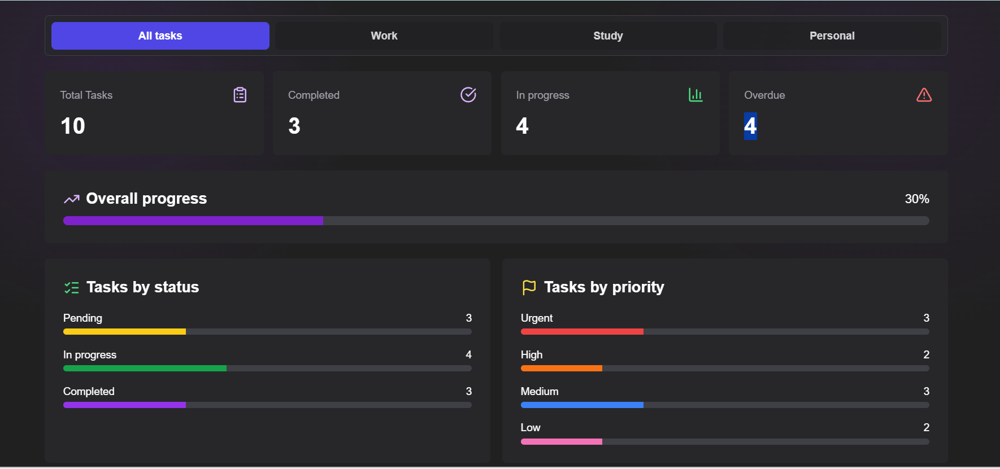
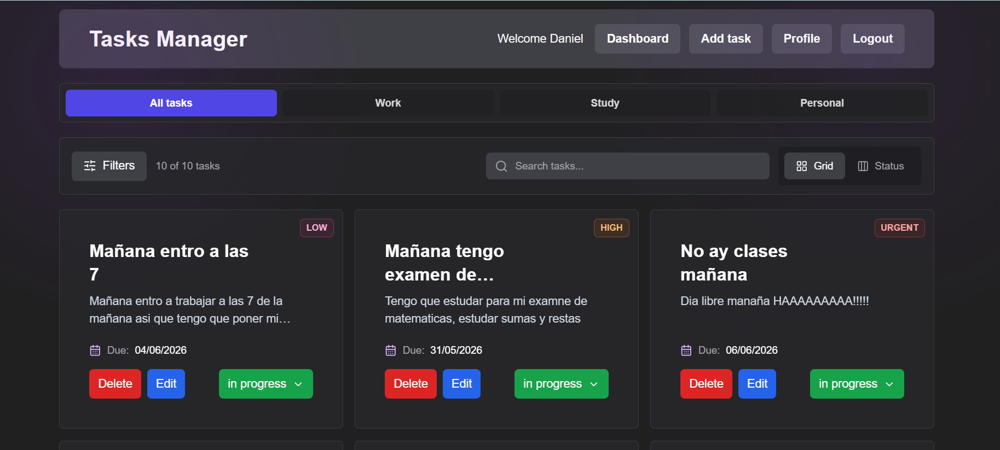
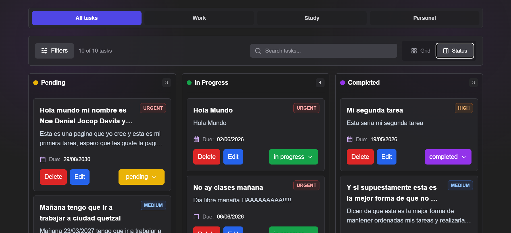
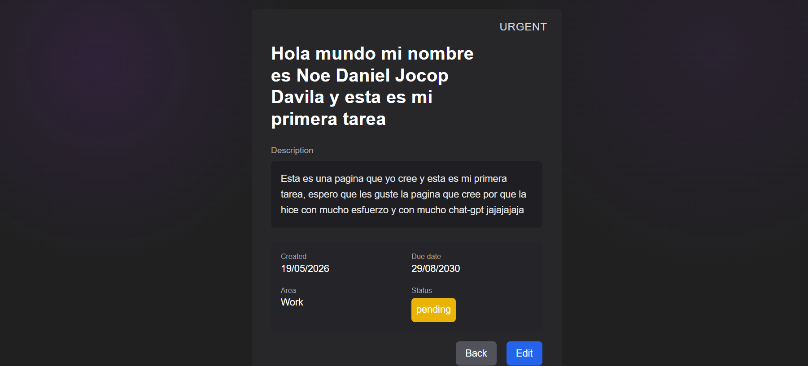
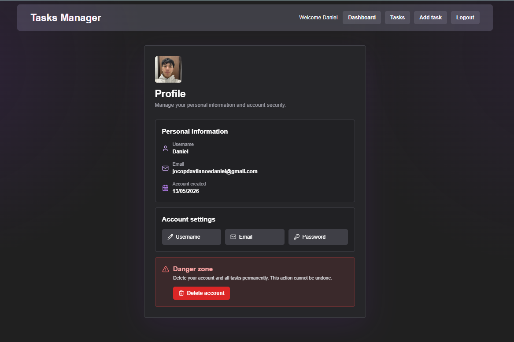

# Tasks Manager

Tasks Manager is a full stack web application for managing personal tasks. It allows users to create an account, log in, organize tasks by status, priority, and area, review statistics through a dashboard, use a Kanban view, and manage their profile information.

This is my first complete full stack project. It started as a basic CRUD practice project using React, Node.js, Express, and MongoDB, but little by little I added more features to make it feel closer to a real application and not just a basic exercise.

---

## Table of Contents

- [About the project](#about-the-project)
- [Why I built this project](#why-i-built-this-project)
- [Screenshots](#screenshots)
- [Main features](#main-features)
- [Technologies used](#technologies-used)
- [General structure](#general-structure)
- [Environment variables](#environment-variables)
- [Installation](#installation)
- [Local setup](#local-setup)
- [Main pages](#main-pages)
- [Challenges I faced during development](#challenges-i-faced-during-development)
- [What I learned](#what-i-learned)
- [Roadmap](#roadmap)
- [Project status](#project-status)
- [Author](#author)
- [Personal note](#personal-note)

---

## About the project

Tasks Manager allows each user to have their own private space to create, edit, delete, and organize tasks.

Each task can have:

- title;
- description;
- status;
- priority;
- area;
- due date.

The application also includes a dashboard with general metrics, a tasks view with filters and search, a Trello-style Kanban view, a profile page, and options to update account information such as username, email, and password.

The project is divided into two parts:

- **Frontend:** React + Vite.
- **Backend:** Node.js + Express + MongoDB.

---

## Why I built this project

I built this project to practice the complete workflow of a real web application. I wanted to better understand how the frontend, backend, and database connect with each other.

At first, the idea was to build a simple task app, but as I kept learning, I added new features such as authentication, protected routes, a dashboard, task statuses, priorities, profile image upload, and an interface that felt comfortable to use.

---

## Screenshots

### Landing Page



### Dashboard



### Tasks Page



### Kanban View



### Task Detail



### Profile Page



---

## Main features

### Authentication and user management

- User registration.
- Login.
- Logout.
- Session verification.
- Protected routes.
- Token management with cookies.
- Username update.
- Email update.
- Password change.
- Account deletion.
- Profile picture using Cloudinary.

### Task management

- Create tasks.
- Edit tasks.
- Delete tasks.
- View task details.
- Confirmation before deleting.
- Quick status change.
- Search tasks by title or description.
- Filter tasks by status, priority, due date, and area.
- Sort tasks by date, priority, and due date.

### Task statuses

- Pending.
- In progress.
- Completed.

### Priorities

- Low.
- Medium.
- High.
- Urgent.

### Areas

- Work.
- Study.
- Personal.

### Dashboard

- Total tasks.
- Completed tasks.
- Tasks in progress.
- Overdue tasks.
- General progress percentage.
- Statistics by status.
- Statistics by priority.
- Filter by area.
- Upcoming tasks by due date.

### Kanban view

- Column-based view according to the task status.
- Drag and drop to move tasks between columns.
- Automatic status update when a task is moved.
- Trello-style visual organization.

### User experience

- Landing page.
- Custom empty states.
- Loading screens.
- Notifications.
- Confirmation modal.
- 404 page.
- Task not found page.
- Dark design with Tailwind CSS.

---

## Technologies used

### Frontend

- React.
- Vite.
- React Router DOM.
- Axios.
- Tailwind CSS.
- React Hook Form.
- Day.js.
- Lucide React.
- DnD Kit.

### Backend

- Node.js.
- Express.
- MongoDB.
- Mongoose.
- JSON Web Token.
- Bcrypt.js.
- Zod.
- Cookie Parser.
- CORS.
- Multer.
- Cloudinary.
- Dotenv.

### Tools

- Visual Studio Code.
- Git.
- GitHub.
- MongoDB Atlas.
- Cloudinary.

---

## General structure

```txt
tasks-manager/
│
├── cliente/
│   ├── src/
│   │   ├── api/
│   │   ├── components/
│   │   ├── context/
│   │   ├── hooks/
│   │   ├── pages/
│   │   ├── utils/
│   │   ├── App.jsx
│   │   └── main.jsx
│   │
│   ├── package.json
│   └── vite.config.js
│
├── src/
│   ├── constants/
│   ├── controllers/
│   ├── libs/
│   ├── middlewares/
│   ├── models/
│   ├── routes/
│   ├── schemas/
│   ├── app.js
│   ├── config.js
│   ├── db.js
│   └── index.js
│
├── package.json
└── README.md
```

---

## Environment variables

To run the project, it is necessary to create `.env` files in both the backend and the frontend.

### Backend

Create a `.env` file in the root of the project:

```env
PORT=4000
MONGODB_URI=your_mongodb_connection_string
TOKEN_SECRET=your_jwt_secret
CLIENT_URL=http://localhost:5173
NODE_ENV=development

CLOUDINARY_CLOUD_NAME=your_cloudinary_cloud_name
CLOUDINARY_API_KEY=your_cloudinary_api_key
CLOUDINARY_API_SECRET=your_cloudinary_api_secret
```

### Frontend

Create a `.env` file inside the `cliente` folder:

```env
VITE_API_URL=http://localhost:4000/api
```

---

## Installation

### 1. Clone the repository

```bash
git clone https://github.com/DanielDavila-coder/tasks-manager.git
```

### 2. Enter the project folder

```bash
cd tasks-manager
```

### 3. Install backend dependencies

```bash
npm install
```

### 4. Install frontend dependencies

```bash
cd cliente
npm install
```

---

## Local setup

### Run the backend

From the root of the project:

```bash
npm run dev
```

The backend runs on:

```txt
http://localhost:4000
```

### Run the frontend

From the `cliente` folder:

```bash
npm run dev
```

The frontend runs on:

```txt
http://localhost:5173
```

---

## Main pages

### Landing Page

The initial page of the application. It explains the main idea of the project and shows a preview of the features before logging in.

### Dashboard

Displays a summary of the user's tasks with statistics, general progress, tasks by status, tasks by priority, and upcoming tasks by due date.

### Tasks Page

The main page for managing tasks. It includes search, filters, sorting, quick status change, card view, and Kanban view.

### Kanban View

A Trello-style view where tasks are separated by status. It allows users to move tasks between columns using drag and drop.

### Task Detail

A page to view the complete details of a task.

### Profile

A page where the user can update their information, change their password, upload a profile picture, and delete their account.

---

## Challenges I faced during development

Some challenges I faced during this project were:

- Understanding how to manage authentication with JWT and cookies.
- Correctly connecting the frontend with the backend using Axios.
- Protecting private routes in React.
- Keeping the global authentication and task state updated.
- Validating forms and displaying errors in an understandable way.
- Uploading images with Cloudinary and saving the URL in the database.
- Creating dashboard statistics using real task data.
- Implementing quick status changes without having to open the edit form.
- Creating a Kanban view with drag and drop.
- Improving the interface so it did not feel like a simple CRUD app.

---

## What I learned

With this project, I learned how the different parts of a full stack application connect with each other.

On the frontend, I practiced React, protected routes, forms, context management, HTTP requests, reusable components, and design with Tailwind CSS.

On the backend, I practiced Express, routes, controllers, middlewares, validation with Zod, Mongoose models, JWT authentication, password encryption, and integration with external services like Cloudinary.

I also learned that an application should not only work, but also provide a good user experience. That is why I added loading screens, messages, empty states, confirmations, and a more polished interface.

Since this is my first full stack project, there are still things I can improve, but it helped me a lot to understand how a real application is organized.

---

## Roadmap

Some improvements I would like to add in future versions:

- Calendar view to organize tasks by due date.
- Subtasks or checklists inside each task.
- Reminders for upcoming tasks.
- Password recovery by email.
- Improvements to the mobile experience.
- More productivity charts.
- Custom tags to classify tasks.

---

## Project status

The project is functional and includes the main features implemented.

It currently allows users to register, log in, manage tasks, use the dashboard, organize tasks with Kanban, update their profile, upload a profile picture, and delete their account.

---

## Author

**Daniel Davila**

- GitHub: https://github.com/DanielDavila-coder
- LinkedIn: https://www.linkedin.com/in/daniel-davila-490b9a227

---

## Personal note

This project represents my first step in building a more complete full stack application. It started as a basic practice project about implementing login and registration, but I kept adding features and fixing details little by little while learning, until I created a web application with real practical value.

The part that helped me the most was understanding how the frontend, backend, and database connect within a single project. It also helped me practice how to turn a simple idea into a more complete and presentable application.

